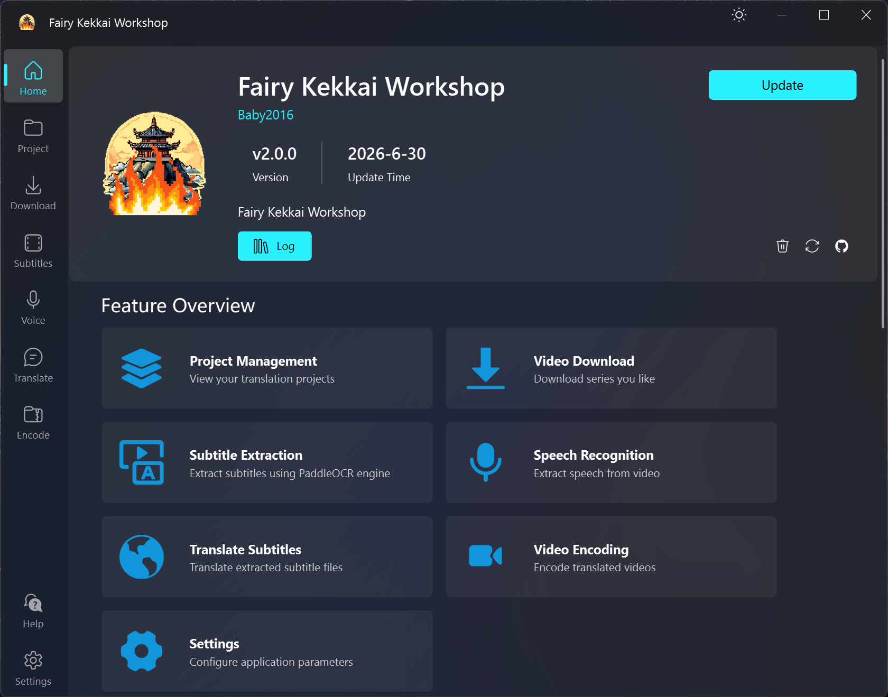

<p align="center">
  
</p>

<h1 align="center">
  Fairy Kekkai Workshop
</h1>

<p align="center">
  <a href="https://fkw.ora-san.org/">Official Website</a>
</p>

<p align="center">
  <i>All-in-one video subtitle processing software</i>
</p>

<p align="center">
  Complete project management, support for 1800+ video download sites, one-click project creation from YouTube playlists, PaddleOCR-based video OCR, Whisper speech recognition, customizable AI subtitle translation, and FFmpeg-based video compression.
</p>

<p align="center">
  <a style="text-decoration:none">
    
  </a>

  <a style="text-decoration:none">
    
  </a>

  <a style="text-decoration:none">
    
  </a>

  <a style="text-decoration:none">
    
  </a>

  <a style="text-decoration:none">
    
  </a>
</p>

<p align="center">
 <a href="README.md">English</a> | <a href="README.zh.md">简体中文</a>
</p>



<p align="center">
  <a href="#features">Features</a> •
  <a href="#quick-start">Quick Start</a> •
  <a href="#usage">Usage</a> •
  <a href="#configuration">Configuration</a> •
  <a href="#faq">FAQ</a>
</p>


## Features

### 📁 Project Management
- Complete project file system management
- Support for importing/linking external projects
- Automatic project progress tracking (cover, raw video, cooked video, original subtitles, translated subtitles)
- Intelligent batch task filtering and dispatch
- Support for one-click project creation from YouTube playlists

### 📥 Video Download
- Based on yt-dlp, supports 1800+ video sites
- Support for playlist batch download
- Automatic video cover download
- Configurable concurrent download count
- Support for custom video quality and format

### 🔤 Subtitle Extraction (OCR)
- Integrated PaddleOCR with custom OCR parameters
- Visual subtitle area selection
- Support for dual-area OCR (top and bottom subtitles)
- GPU acceleration support
- Real-time log output

### 🎙️ Speech Recognition
- Based on [Const-me/Whisper](https://github.com/Const-me/Whisper)
- Multi-language speech-to-subtitle support (Chinese, Japanese, English, Korean, etc.)
- Real-time progress display
- Support for SRT, TXT, VTT output formats
- GPU acceleration support

### 🌐 Smart Translation
- Support for multiple AI models: Deepseek, Tencent Hunyuan, ERNIE, Gemini, InternLM, etc.
- Customizable translation prompt templates
- Deepseek exclusive features: model switching (v4-flash/v4-pro) and deep reasoning mode
- Real-time translation progress display
- Support for streaming output

### 🎬 Video Compression
- Based on FFmpeg with custom encoding parameters
- Hardware acceleration support (CUDA, VideoToolbox)
- Automatic subtitle embedding
- Real-time log output

### 🎨 Interface Features
- Modern UI design (PySide6 + QFluentWidgets)
- Title bar quick theme switching (dark/light mode)
- Splash screen with progress bar and status text
- Quick navigation between adjacent files
- Visual project progress display
- Multi-language support (Chinese, English)

---

## System Requirements

- **Operating System**: Windows 10/11 (recommended)
  - OCR and speech recognition features are Windows-only
  - Other features support macOS/Linux
- **Python**: 3.9+
- **Hardware**:
  - GPU (optional): For OCR, Whisper, and video compression acceleration
  - Memory: 8GB or more recommended

---

## Quick Start

### 1. Clone the repository

```bash
git clone https://github.com/Fairy-Oracle-Sanctuary/Fairy-Kekkai-Workshop.git
cd Fairy-Kekkai-Workshop
```

### 2. Create virtual environment (uv recommended)

```bash
uv venv
# Windows
.venv\Scripts\activate
# Unix/macOS
source .venv/bin/activate
```

### 3. Install dependencies

```bash
uv pip install -r requirements.txt
```

### 4. Prepare external tools

Download `tools.zip` from the [Releases](https://github.com/Fairy-Oracle-Sanctuary/Fairy-Kekkai-Workshop/releases) page and extract it into the `tools/` directory at the project root. No manual compilation or separate installation of external tools is required.

### 5. Run the application

```bash
python Fairy-Kekkai-Workshop.py
```

---

## Usage

### First Run

On first run, a tutorial will be displayed introducing the main features and usage of the software.

### Home Page Features

- **About Card**: Displays application version information, includes clear logs and reset settings buttons
- **Project Management**: Create and manage video subtitle projects
- **Download**: Download videos from YouTube and other platforms
- **OCR**: Extract hard subtitles from videos (Windows only)
- **Speech Recognition**: Extract speech-to-subtitles from videos (Windows only)
- **Translation**: Translate subtitles using AI models
- **Compression**: Compress videos using FFmpeg
- **Settings**: Configure application parameters and external tool paths

### Project Management Workflow

1. **Create Project**: Manual creation or import from YouTube playlist
2. **Add Episodes**: Set episode number, title, video URL
3. **Batch Tasks**: Select task type, intelligently filter eligible episodes
4. **Execute Tasks**: Automatically dispatch to corresponding feature interfaces via event bus
5. **Progress Tracking**: Automatically update project progress with visual display

### Theme Switching

Click the theme switch button to the left of the minimize button in the title bar to quickly switch between dark/light mode.

### Log Management

- Logs are automatically saved to the `AppData/Log/` directory
- Click the clear logs button in the "About" card on the home page to clear all logs

### Reset Settings

- Click the reset settings button in the "About" card on the home page to restore default configuration
- The application will automatically restart after reset

---

## Configuration

Main configuration items can be modified in the settings page:

### Personalization
- Theme mode (dark/light)
- Theme color
- Interface scaling
- Background image
- Language (Chinese/English)

### Project
- Number of project detail pages

### Download
- yt-dlp path
- FFmpeg path
- Video format
- Video quality
- Maximum concurrent downloads

### Whisper (Windows only)
- CLI path
- Model path
- Language selection
- Output format

### AI Translation
- API Key configuration for each AI model
- Deepseek model selection (v4-flash/v4-pro)
- Deepseek deep reasoning mode toggle
- Translation prompt template

---

## Development Documentation

For detailed development documentation, please refer to [DEVELOPMENT.md](DEVELOPMENT.md)

---

## FAQ

### Q: Application shows Shiboken warning on startup

A: This is a normal PySide6 warning and does not affect functionality. It can be safely ignored.

### Q: Subtitle extraction failed

A:
1. Ensure `paddleocr.exe` exists in the `tools/PaddleOCR/` directory
2. Ensure OCR model files exist in the `tools/OCR.model/` directory
3. Check if VC++ runtime is installed (requires MSVCP140.dll and VCRUNTIME140.dll)
4. Check if GPU driver supports DirectML (if using GPU)
5. If `t2s.json not found` error occurs after packaging, ensure OpenCC dictionary files are correctly packaged

### Q: Whisper speech recognition failed

A:
1. Ensure WhisperNetCLI.exe exists in the `tools/Whisper/` directory
2. Ensure all dependent DLLs (Whisper.dll, WhisperNet.dll, ComLight.dll) are in the same directory
3. Ensure Whisper model files exist in the `tools/Whisper.model/` directory
4. When language is set to `auto`, CLI will automatically detect language
5. Check if GPU driver supports DirectML (if using GPU)

### Q: Translation function unavailable

A:
- Ensure the corresponding AI service API Key is configured (in settings page)
- Some AI models (Spark, GLM) are disabled due to SDK incompatibility
- Deepseek or Tencent Hunyuan are recommended (better support)
- Deepseek deep reasoning mode increases inference time but provides higher translation quality

### Q: Batch task addition failed

A:
1. Check if project file structure is complete (title.txt, episode folders)
2. Ensure filter conditions are correct (e.g., download tasks require video URL)
3. Check if file paths contain Chinese characters (some tools don't support them)

---

## Known Limitations

| Feature | Status | Notes |
|---------|--------|-------|
| Video Download | ✅ | Based on yt-dlp, supports 1800+ sites |
| Subtitle Extraction | ✅ | PaddleOCR, requires manual model installation, Windows only |
| Speech Recognition | ✅ | WhisperNet, Windows only, real-time progress support |
| Translation | ✅ | Multi-AI model support, some SDKs incompatible |
| Video Compression | ✅ | Based on FFmpeg, supports multiple encoders |
| Bilibili Upload | ⚠️ | Feature implemented but not officially enabled due to API issues |
| Batch Processing | ✅ | Supports batch tasks with intelligent filtering |

---

## Tech Stack

- **UI Framework**: PySide6 + QFluentWidgets (Modern UI)
- **Video Processing**: FFmpeg + yt-dlp
- **Subtitle Recognition**: paddleocr
- **Speech Recognition**: [Const-me/Whisper](https://github.com/Const-me/Whisper)
- **Translation**: Multiple cloud APIs (OpenAI, Deepseek, Tencent Hunyuan, etc.)
- **Configuration Storage**: JSON
- **Logging**: Built-in Logger
- **Package Management**: uv (recommended)

---

## Contributing

1. Fork this repository
2. Create a feature branch (`git checkout -b feature/AmazingFeature`)
3. Commit your changes (`git commit -m 'Add AmazingFeature'`)
4. Push to the branch (`git push origin feature/AmazingFeature`)
5. Open a Pull Request

For detailed development guidelines, please refer to [DEVELOPMENT.md](DEVELOPMENT.md)

---

## License

This project is licensed under the GPL license. See the LICENSE file in the repository root for details.

**Special Note**: The software icon is separately licensed under CC-BY-SA.

---

## Acknowledgments

- videocli from [VideOCR](https://github.com/timminator/VideOCR)
- OCR implementation ideas from [LunaTranslator](https://github.com/HIllya51/LunaTranslator)
- Whisper from [Const-me/Whisper](https://github.com/Const-me/Whisper)

---

<a href="https://github.com/Fairy-Oracle-Sanctuary/Fairy-Kekkai-Workshop/graphs/contributors">  </a>

## Star History

<a href="https://www.star-history.com/?repos=Fairy-Oracle-Sanctuary%2FFairy-Kekkai-Workshop&type=date&legend=top-left">
 <picture>
   <source media="(prefers-color-scheme: dark)" srcset="https://api.star-history.com/chart?repos=Fairy-Oracle-Sanctuary/Fairy-Kekkai-Workshop&type=date&theme=dark&legend=top-left" />
   <source media="(prefers-color-scheme: light)" srcset="https://api.star-history.com/chart?repos=Fairy-Oracle-Sanctuary/Fairy-Kekkai-Workshop&type=date&legend=top-left" />
   
 </picture>
</a>
