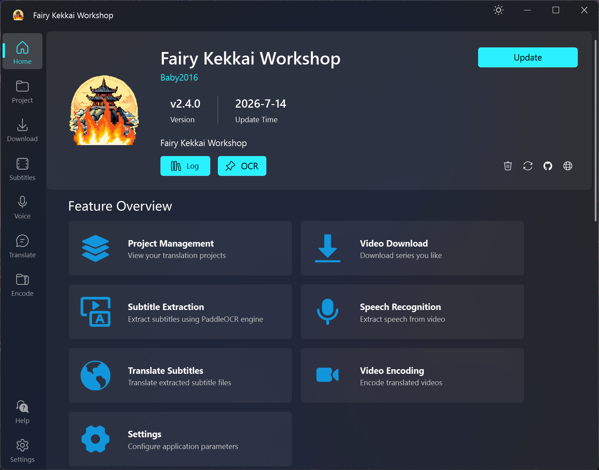

<p align="center">
  
</p>

<h1 align="center">
  Fairy Kekkai Workshop
</h1>

<p align="center">
  <a href="https://fkw.ora-san.org/">Official Website</a>
</p>

<p align="center">
  <i>All-in-one video subtitle processing software</i>
</p>

<p align="center">
  Complete project management, support for 1800+ video download sites, one-click project creation from video playlists (supports all yt-dlp supported sites), VideOCR-based video OCR (supporting PaddleOCR and Google Lens engines), Whisper speech recognition, customizable AI subtitle translation, floating on-screen capture translation, and FFmpeg-based video compression.
</p>

<p align="center">
  <a style="text-decoration:none">
    
  </a>

  <a style="text-decoration:none">
    
  </a>

  <a style="text-decoration:none">
    
  </a>

  <a style="text-decoration:none">
    
  </a>

  <a style="text-decoration:none">
    
  </a>

  <a style="text-decoration:none">
    
  </a>
</p>

<p align="center">
 <a href="README.md">English</a> | <a href="README.zh.md">简体中文</a>
</p>



<p align="center">
  <a href="#features">Features</a> •
  <a href="#quick-start">Quick Start</a> •
  <a href="#usage">Usage</a> •
  <a href="#configuration">Configuration</a> •
  <a href="#faq">FAQ</a>
</p>


## Features

### 📁 Project Management
- Complete project file system management
- Support for importing/linking external projects
- Automatic project progress tracking (cover, raw video, cooked video, original subtitles, translated subtitles)
- Intelligent batch task filtering and dispatch
- Support for one-click project creation from video playlists (all yt-dlp supported sites)
- Automatic migration of projects scattered in the install directory to a dedicated data directory on first launch

### 📥 Video Download
- Based on yt-dlp, supports 1800+ video sites
- Support for playlist batch download
- Automatic video cover download
- Configurable concurrent download count
- Support for custom video quality and format

### 🔤 Subtitle Extraction (OCR)
- Based on [VideOCR](https://github.com/timminator/VideOCR), supporting both PaddleOCR and Google Lens engines
- Supports 200+ languages
- Visual subtitle area selection
- Support for dual-area OCR (top and bottom subtitles)
- GPU acceleration support (CUDA)
- Real-time log output

### 🎙️ Speech Recognition
- Based on [Const-me/Whisper](https://github.com/Const-me/Whisper)
- Multi-language speech-to-subtitle support (Chinese, Japanese, English, Korean, etc.)
- Real-time progress display
- Support for SRT, TXT, VTT output formats
- GPU acceleration support

### 🌐 Smart Translation
- Support for multiple AI models: Deepseek, Tencent Hunyuan, ERNIE, Gemini, InternLM, etc.
- Customizable translation prompt templates
- Deepseek exclusive features: model switching (v4-flash/v4-pro) and deep reasoning mode
- Real-time translation progress display
- Support for streaming output

### 🔍 Floating Screen Capture Translation (New)
- Select any region on screen to OCR and translate with AI without leaving the current window
- Window binding: lock the selected region to a target window and follow its move/resize automatically
- Always-on-top, lock, click-through, transparent background and rounded-corner display modes
- Built-in history to review and copy previous OCR / translation results

### 🎬 Video Compression
- Based on FFmpeg with custom encoding parameters
- Hardware acceleration support (CUDA, VideoToolbox)
- Automatic subtitle embedding
- Real-time log output

### 🎨 Interface Features
- Modern UI design (Qt 6 + Qt-Fluent-Widgets, native C++ implementation)
- Title bar quick theme switching (dark/light mode)
- Splash screen with progress bar and status text
- Quick navigation between adjacent files
- Visual project progress display
- Multi-language support (9 languages)

---

## System Requirements

- **Operating System**: Windows 10/11 (recommended)
  - OCR, speech recognition and floating screen capture are Windows-only
  - Other features support macOS/Linux
- **How to run**:
  - Using the installer: **no Python required**, all runtime dependencies are bundled
  - Building from source: C++17 compiler (MSVC 2022), CMake 3.21+, Qt 6 (Widgets/Svg/Network), OpenCV 4.12
- **Hardware**:
  - GPU (optional): For OCR, Whisper, and video compression acceleration
  - Memory: 8GB or more recommended

> Since 3.0.0 the main application has been fully rewritten from Python + PySide6 to a native C++ + Qt 6 program. The `app/` directory keeps the legacy Python implementation for reference only and is no longer shipped in the installer.

---

## Quick Start

### Option 1: Install directly (recommended)

Download the installer matching your GPU from the [Releases](https://github.com/Fairy-Oracle-Sanctuary/Fairy-Kekkai-Workshop/releases) page and follow the setup wizard. No development environment is required.

- CPU: for machines without a discrete GPU / without CUDA support
- GPU (CUDA 11.8): for Nvidia 10 series
- GPU (CUDA 12.9): for Nvidia 16 - 50 series

### Option 2: Build from source (C++)

#### 1. Clone the repository

```bash
git clone https://github.com/Fairy-Oracle-Sanctuary/Fairy-Kekkai-Workshop.git
cd Fairy-Kekkai-Workshop
```

#### 2. Prepare dependencies

- Qt 6 (with Widgets / Svg / Network modules)
- OpenCV 4.12 (core, videoio)
- CMake 3.21+ and Visual Studio 2022

#### 3. Build

```bash
cmake -S cpp -B cpp/build -DCMAKE_BUILD_TYPE=Release
cmake --build cpp/build --config Release
```

You can also use the one-click packaging script to build, collect dependencies and produce the installer:

```powershell
.\package-cpp-release.ps1
```

#### 4. Prepare external tools

Download `tools.zip` from the [Releases](https://github.com/Fairy-Oracle-Sanctuary/Fairy-Kekkai-Workshop/releases) page and extract it into the `tools/` directory at the project root. No manual compilation or separate installation of external tools is required.

---

## Usage

### First Run

On first run, a tutorial will be displayed introducing the main features and usage of the software.

### Home Page Features

- **About Card**: Displays application version information, includes clear logs and reset settings buttons
- **Project Management**: Create and manage video subtitle projects
- **Download**: Download videos from YouTube and other platforms
- **OCR**: Extract hard subtitles from videos (Windows only)
- **Speech Recognition**: Extract speech-to-subtitles from videos (Windows only)
- **Translation**: Translate subtitles using AI models
- **Floating Screen Capture**: Select a region on screen to OCR and translate directly (Windows only)
- **Compression**: Compress videos using FFmpeg
- **Settings**: Configure application parameters and external tool paths

### Project Management Workflow

1. **Create Project**: Manual creation or import from video playlist (all yt-dlp supported sites)
2. **Add Episodes**: Set episode number, title, video URL
3. **Batch Tasks**: Select task type, intelligently filter eligible episodes
4. **Execute Tasks**: Automatically dispatch to corresponding feature interfaces via event bus
5. **Progress Tracking**: Automatically update project progress with visual display

### Floating Screen Capture

1. Click the "Floating Screen Capture" button on the home page to open the floating window
2. Click the select button and drag to choose the region to recognize on screen
3. After recognition completes, pick the target language and trigger translation; the result shows directly in the floating window
4. Use the toolbar to toggle always-on-top, lock, click-through and transparent background modes; the history button reviews previous results

### Theme Switching

Click the theme switch button to the left of the minimize button in the title bar to quickly switch between dark/light mode.

### Log Management

- Logs are automatically saved to the `AppData/Log/` directory
- Click the clear logs button in the "About" card on the home page to clear all logs

### Reset Settings

- Click the reset settings button in the "About" card on the home page to restore default configuration
- The application will automatically restart after reset

---

## Configuration

Main configuration items can be modified in the settings page:

### Personalization
- Theme mode (dark/light)
- Theme color
- Interface scaling
- Background image
- Language (9 languages)

### Project
- Number of project detail pages

### Download
- yt-dlp path
- FFmpeg path
- Video format
- Video quality
- Maximum concurrent downloads

### Whisper (Windows only)
- CLI path
- Model path
- Language selection
- Output format

### AI Translation
- API Key configuration for each AI model
- Deepseek model selection (v4-flash/v4-pro)
- Deepseek deep reasoning mode toggle
- Translation prompt template

---

## Development Documentation

- General development guide: [DEVELOPMENT.md](DEVELOPMENT.md)
- C++ porting progress matrix: [cpp/PORTING_MATRIX.md](cpp/PORTING_MATRIX.md)

---

## FAQ

### Q: Application shows Shiboken warning on startup (legacy Python build only)

A: This is a normal PySide6 warning and does not affect functionality. It can be safely ignored. Since 3.0.0 the main application no longer uses Python.

### Q: Building the C++ version from source fails

A:
1. Make sure CMake can locate Qt 6 (set `CMAKE_PREFIX_PATH` to your Qt installation if needed)
2. Make sure `OpenCV_DIR` points to the OpenCV `build` directory, or extract OpenCV to `D:/CODE/opencv-4.12.0/build`
3. Make sure you are using the Visual Studio 2022 toolchain with C++17 support
4. If `opencv_world4120.dll` is missing, check that your OpenCV version is 4.12

### Q: Subtitle extraction failed

A:
1. Ensure `videocr-cli.exe` exists in the `tools/` directory
2. Ensure PaddleOCR model files exist in the `tools/OCR.model/` directory
3. Check if VC++ runtime is installed (requires MSVCP140.dll and VCRUNTIME140.dll)
4. Check if GPU driver supports CUDA (if using GPU)
5. If using Google Lens engine, ensure network connection is active

### Q: Whisper speech recognition failed

A:
1. Ensure WhisperNetCLI.exe exists in the `tools/Whisper/` directory
2. Ensure all dependent DLLs (Whisper.dll, WhisperNet.dll, ComLight.dll) are in the same directory
3. Ensure Whisper model files exist in the `tools/Whisper.model/` directory
4. When language is set to `auto`, CLI will automatically detect language
5. Check if GPU driver supports DirectML (if using GPU)

### Q: Floating screen capture cannot select a region

A:
1. The feature is Windows-only and requires administrator privileges (the installer requests elevation on launch)
2. Region selection relies on Win32 window APIs; windows running elevated may not be bindable
3. If click-through mode is enabled, turn it off via the toolbar before selecting a region

### Q: Translation function unavailable

A:
- Ensure the corresponding AI service API Key is configured (in settings page)
- Some AI models (Spark, GLM) are disabled due to SDK incompatibility
- Deepseek or Tencent Hunyuan are recommended (better support)
- Deepseek deep reasoning mode increases inference time but provides higher translation quality

### Q: Batch task addition failed

A:
1. Check if project file structure is complete (title.txt, episode folders)
2. Ensure filter conditions are correct (e.g., download tasks require video URL)
3. Check if file paths contain Chinese characters (some tools don't support them)

---

## Known Limitations

| Feature | Status | Notes |
|---------|--------|-------|
| Video Download | ✅ | Based on yt-dlp, supports 1800+ sites |
| Subtitle Extraction | ✅ | Based on VideOCR, supports PaddleOCR/Google Lens engines, Windows only |
| Speech Recognition | ✅ | WhisperNet, Windows only, real-time progress support |
| Translation | ✅ | Multi-AI model support, some SDKs incompatible |
| Floating Screen Capture | ✅ | Windows only, supports window binding and following |
| Video Compression | ✅ | Based on FFmpeg, supports multiple encoders |
| Bilibili Upload | ⚠️ | Feature implemented but not officially enabled due to API issues |
| Batch Processing | ✅ | Supports batch tasks with intelligent filtering |

---

## Tech Stack

- **Main Application**: C++17 + Qt 6 + Qt-Fluent-Widgets (native desktop app)
- **Image Processing**: OpenCV 4.12
- **Video Processing**: FFmpeg + yt-dlp
- **Subtitle Recognition**: [VideOCR](https://github.com/timminator/VideOCR) (PaddleOCR / Google Lens)
- **Speech Recognition**: [Const-me/Whisper](https://github.com/Const-me/Whisper)
- **Translation**: Multiple cloud APIs (OpenAI, Deepseek, Tencent Hunyuan, etc.)
- **JSON**: nlohmann/json (header-only)
- **Configuration Storage**: JSON
- **Build System**: CMake 3.21+ / MSVC 2022
- **Packaging**: windeployqt + Inno Setup (`package-cpp-release.ps1`); releases are published by GitHub Actions, which builds and ships all four variants on tag push (`.github/workflows/build-cpp.yml`)

> The `app/` directory keeps the legacy Python + PySide6 implementation (build scripts for external tools such as the VideOCR CLI still live there) for porting reference only.

---

## Contributing

1. Fork this repository
2. Create a feature branch (`git checkout -b feature/AmazingFeature`)
3. Commit your changes (`git commit -m 'Add AmazingFeature'`)
4. Push to the branch (`git push origin feature/AmazingFeature`)
5. Open a Pull Request

For detailed development guidelines, please refer to [DEVELOPMENT.md](DEVELOPMENT.md)

---

## License

This project is licensed under the GPL license. See the LICENSE file in the repository root for details.

**Special Note**: The software icon is separately licensed under CC-BY-SA.

---

## Acknowledgments

- OCR engine from [VideOCR](https://github.com/timminator/VideOCR)
- Whisper from [Const-me/Whisper](https://github.com/Const-me/Whisper)

---

<a href="https://github.com/Fairy-Oracle-Sanctuary/Fairy-Kekkai-Workshop/graphs/contributors">  </a>

## Star History

<a href="https://www.star-history.com/?repos=Fairy-Oracle-Sanctuary%2FFairy-Kekkai-Workshop&type=date&legend=top-left">
 <picture>
   <source media="(prefers-color-scheme: dark)" srcset="https://api.star-history.com/chart?repos=Fairy-Oracle-Sanctuary/Fairy-Kekkai-Workshop&type=date&theme=dark&legend=top-left" />
   <source media="(prefers-color-scheme: light)" srcset="https://api.star-history.com/chart?repos=Fairy-Oracle-Sanctuary/Fairy-Kekkai-Workshop&type=date&theme=light&legend=top-left" />
   
 </picture>
</a>
