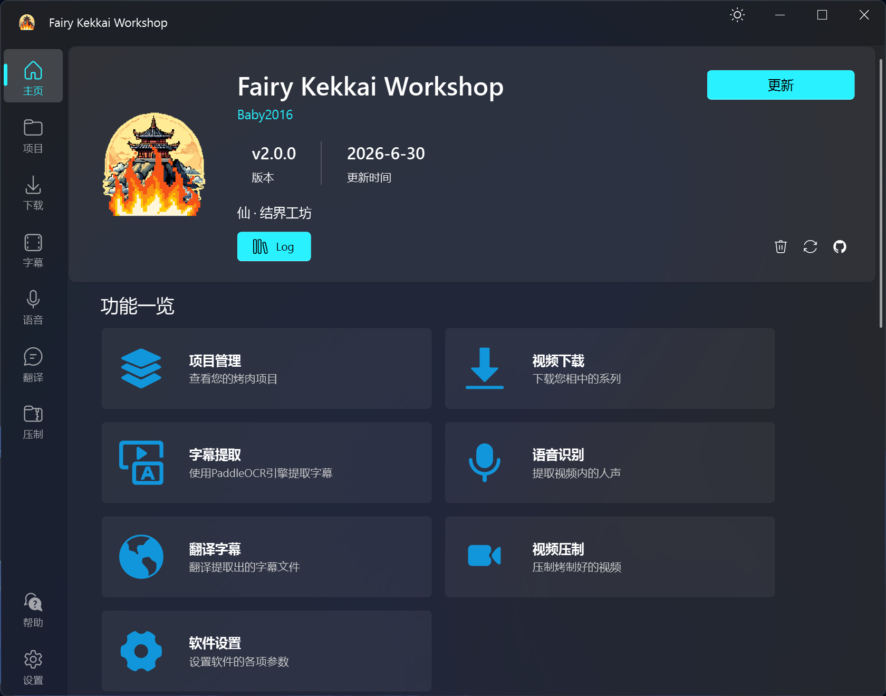

<p align="center">
  
</p>

<h1 align="center">
  Fairy Kekkai Workshop
</h1>

<p align="center">
  <i>一站式烤肉自由软件</i>
</p>

<p align="center">
  完整的项目管理、支持1800+网站视频下载、对于YouTube额外支持根据视频列表一键创建项目、基于PaddleOCR的视频OCR、Whisper语音识别、可自定义接入AI的字幕文件翻译、基于FFmpeg的视频压制。
</p>

<p align="center">
  <a style="text-decoration:none">
    
  </a>

  <a style="text-decoration:none">
    
  </a>

  <a style="text-decoration:none">
    
  </a>

  <a style="text-decoration:none">
    
  </a>

  <a style="text-decoration:none">
    
  </a>
</p>

<p align="center">
 <a href="README.md">English</a> | <a href="README.zh.md">简体中文</a>
</p>



<p align="center">
  <a href="#功能特性">功能特性</a> •
  <a href="#快速开始">快速开始</a> •
  <a href="#使用说明">使用说明</a> •
  <a href="#配置说明">配置说明</a> •
  <a href="#常见问题">常见问题</a>
</p>


## 功能特性

### 📁 项目管理
- 完整的项目文件系统管理
- 支持导入/链接外部项目
- 项目进度自动追踪（封面、原视频、熟肉、原字幕、译文）
- 批量任务智能筛选和派发
- 支持从YouTube播放列表一键创建项目

### 📥 视频下载
- 基于 yt-dlp，支持1800+视频网站
- 支持播放列表批量下载
- 自动下载视频封面
- 可配置并发下载数
- 支持自定义视频质量和格式

### 🔤 字幕提取（OCR）
- 集成 PaddleOCR，支持自定义OCR参数
- 可视化字幕区域选择
- 支持双区域OCR（上下字幕）
- 支持GPU加速
- 实时日志输出

### 🎙️ 语音识别
- 基于 [Const-me/Whisper](https://github.com/Const-me/Whisper)
- 支持多语言语音转字幕（中文、日语、英语、韩语等）
- 实时进度显示
- 支持SRT、TXT、VTT输出格式
- 支持GPU加速

### 🌐 智能翻译
- 支持多个AI模型：Deepseek、腾讯混元、ERNIE、Gemini、书生等
- 可自定义翻译提示词模板
- Deepseek专属功能：模型切换（v4-flash/v4-pro）和深度思考模式
- 实时翻译进度显示
- 支持流式输出

### 🎬 视频压制
- 基于FFmpeg，支持自定义编码参数
- 支持硬件加速（CUDA、VideoToolbox）
- 自动嵌入字幕
- 实时输出日志

### 🎨 界面特性
- 现代化UI设计（PySide6 + QFluentWidgets）
- 标题栏快捷主题切换（深色/浅色模式）
- 带进度条和状态文字的启动页
- 相邻文件快速导航
- 项目进度可视化展示
- 多语言支持（中文、英文）

---

## 系统要求

- **操作系统**：Windows 10/11（推荐）
  - OCR和语音识别功能仅支持Windows
  - 其他功能支持macOS/Linux
- **Python**：3.9+
- **硬件**：
  - GPU（可选）：用于OCR、Whisper、视频压制加速
  - 内存：建议8GB以上

---

## 快速开始

### 1. 克隆仓库

```bash
git clone https://github.com/Fairy-Oracle-Sanctuary/Fairy-Kekkai-Workshop.git
cd Fairy-Kekkai-Workshop
```

### 2. 创建虚拟环境（推荐使用 uv）

```bash
uv venv
# Windows
.venv\Scripts\activate
# Unix/macOS
source .venv/bin/activate
```

### 3. 安装依赖

```bash
uv pip install -r requirements.txt
```

### 4. 准备外部工具

#### OCR 工具（仅 Windows）
- 下载 [PaddleOCR](https://github.com/PaddlePaddle/PaddleOCR) 放到 `tools/PaddleOCR/` 目录
- 下载OCR模型文件放到 `tools/OCR.model/` 目录
- 编译videocr CLI：`cd app/service/CLI && python deploy.py`

#### Whisper 工具（仅 Windows）
- 下载Whisper模型文件（ggml格式）放到 `tools/Whisper.model/` 目录
- 编译WhisperNet CLI：`cd app/service/CLI/whispernet && dotnet publish -c Release -r win-x64 --self-contained`
- 复制发布文件夹内容到 `tools/Whisper/` 目录

#### 其他工具
- **FFmpeg**：视频压制工具
  - Windows：下载编译版本或通过 scoop/chocolatey 安装
  - macOS：`brew install ffmpeg`
  - Linux：`sudo apt-get install ffmpeg`
- **yt-dlp**：视频下载工具
  ```bash
  uv pip install yt-dlp
  ```

### 5. 运行应用

```bash
python Fairy-Kekkai-Workshop.py
```

---

## 使用说明

### 首次运行

首次运行时会显示新手引导，介绍软件的主要功能和使用方法。

### 主页功能

- **关于卡片**：显示应用版本信息，包含清空日志和重置设置按钮
- **项目管理**：创建和管理视频字幕项目
- **下载**：从YouTube等平台下载视频
- **OCR**：从视频中提取硬字幕（仅Windows）
- **语音识别**：从视频中提取语音转字幕（仅Windows）
- **翻译**：使用AI模型翻译字幕
- **压制**：使用FFmpeg压制视频
- **设置**：配置应用参数和外部工具路径

### 项目管理流程

1. **创建项目**：手动创建或从YouTube播放列表导入
2. **添加剧集**：设置集数、标题、视频URL
3. **批量任务**：选择任务类型，智能筛选符合条件的剧集
4. **执行任务**：通过事件总线自动派发到对应功能界面
5. **进度追踪**：自动更新项目进度，可视化展示

### 主题切换

点击标题栏最小化按钮左侧的主题切换按钮，可在深色/浅色模式之间快速切换。

### 日志管理

- 日志自动保存到 `AppData/Log/` 目录
- 在主页「关于」卡片中点击清空日志按钮可清空所有日志

### 重置设置

- 在主页「关于」卡片中点击重置设置按钮可恢复默认配置
- 重置后会自动重启应用

---

## 配置说明

主要配置项可在设置页面修改：

### 个性化
- 主题模式（深色/浅色）
- 主题色
- 界面缩放
- 背景图片
- 语言（中文/英文）

### 项目
- 项目详情页数量

### 下载
- yt-dlp路径
- FFmpeg路径
- 视频格式
- 视频质量
- 最大并发下载数

### Whisper（仅 Windows）
- CLI路径
- 模型路径
- 语言选择
- 输出格式

### AI 翻译
- 各AI模型的API Key配置
- Deepseek模型选择（v4-flash/v4-pro）
- Deepseek深度思考模式开关
- 翻译提示词模板

---

## 开发文档

详细的开发文档请参阅 [DEVELOPMENT.md](DEVELOPMENT.md)

---

## 常见问题

### Q: 应用启动时显示 Shiboken 警告

A: 这是 PySide6 的正常警告，不影响功能。可以安全忽略。

### Q: 字幕提取失败

A:
1. 确保 `paddleocr.exe` 存在于 `tools/PaddleOCR/` 目录
2. 确保OCR模型文件存在于 `tools/OCR.model/` 目录
3. 检查VC++运行时是否已安装（需要MSVCP140.dll和VCRUNTIME140.dll）
4. 检查GPU驱动是否支持DirectML（如使用GPU）
5. 如果打包后出现 `t2s.json not found` 错误，需要确保OpenCC字典文件正确打包

### Q: Whisper 语音识别失败

A:
1. 确保 WhisperNetCLI.exe 存在于 `tools/Whisper/` 目录
2. 确保所有依赖DLL（Whisper.dll、WhisperNet.dll、ComLight.dll）在同一目录
3. 确保Whisper模型文件存在于 `tools/Whisper.model/` 目录
4. 语言设置为 `auto` 时，CLI会自动检测语言
5. 检查GPU驱动是否支持DirectML（如使用GPU）

### Q: 翻译功能不可用

A:
- 确保已配置相应AI服务的API Key（在设置页面）
- 部分AI模型（Spark、GLM）因SDK不兼容已禁用
- 推荐使用Deepseek或腾讯混元（支持较好）
- Deepseek深度思考模式会增加推理时间，但翻译质量更高

### Q: 批量任务添加失败

A:
1. 检查项目文件结构是否完整（标题.txt、集文件夹）
2. 确保筛选条件正确（如下载任务需要视频URL）
3. 检查文件路径是否包含中文字符（某些工具不支持）

---

## 已知限制

| 功能 | 状态 | 备注 |
|------|------|------|
| 视频下载 | ✅ | 基于yt-dlp，支持1800+网站 |
| 字幕提取 | ✅ | PaddleOCR，需手动安装模型，仅Windows |
| 语音识别 | ✅ | WhisperNet，仅Windows，支持实时进度 |
| 翻译 | ✅ | 多AI模型支持，部分SDK不兼容 |
| 视频压制 | ✅ | 基于FFmpeg，支持多种编码器 |
| B站上传 | ⚠️ | 功能已实现但因API问题未正式启用 |
| 批量处理 | ✅ | 支持批量任务，智能筛选 |

---

## 技术栈

- **UI框架**：PySide6 + QFluentWidgets (Modern UI)
- **视频处理**：FFmpeg + yt-dlp
- **字幕识别**：paddleocr
- **语音识别**：[Const-me/Whisper](https://github.com/Const-me/Whisper)
- **翻译**：多个云API（OpenAI、Deepseek、腾讯混元等）
- **配置存储**：JSON
- **日志**：内置Logger
- **包管理**：uv（推荐）

---

## 贡献指南

1. Fork 本仓库
2. 创建特性分支 (`git checkout -b feature/AmazingFeature`)
3. 提交更改 (`git commit -m 'Add AmazingFeature'`)
4. 推送到分支 (`git push origin feature/AmazingFeature`)
5. 开启 Pull Request

详细的开发指南请参阅 [DEVELOPMENT.md](DEVELOPMENT.md)

---

## 许可证

本项目采用 GPL 许可证。详见仓库根目录的 LICENSE 文件。

**特别说明**：软件的图标（icon）单独采用 CC-BY-SA 许可证。

---

## 致谢

- videocli 来自 [VideOCR](https://github.com/timminator/VideOCR)
- OCR实现思路来自 [LunaTranslator](https://github.com/HIllya51/LunaTranslator)
- Whisper来自 [Const-me/Whisper](https://github.com/Const-me/Whisper)

---

<a href="https://github.com/Fairy-Oracle-Sanctuary/Fairy-Kekkai-Workshop/graphs/contributors">  </a>

## Star History

<a href="https://www.star-history.com/?repos=Fairy-Oracle-Sanctuary%2FFairy-Kekkai-Workshop&type=date&legend=top-left">
 <picture>
   <source media="(prefers-color-scheme: dark)" srcset="https://api.star-history.com/chart?repos=Fairy-Oracle-Sanctuary/Fairy-Kekkai-Workshop&type=date&theme=dark&legend=top-left" />
   <source media="(prefers-color-scheme: light)" srcset="https://api.star-history.com/chart?repos=Fairy-Oracle-Sanctuary/Fairy-Kekkai-Workshop&type=date&legend=top-left" />
   
 </picture>
</a>