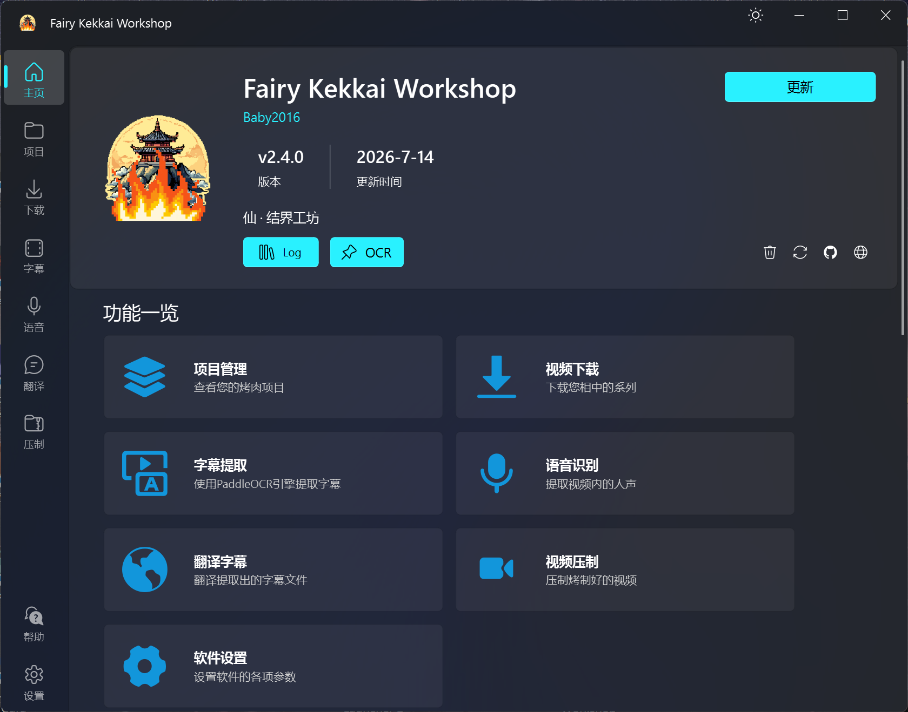

<p align="center">
  
</p>

<h1 align="center">
  Fairy Kekkai Workshop
</h1>

<p align="center">
  <a href="https://fkw.ora-san.org/">软件官网</a>
</p>

<p align="center">
  <i>一站式烤肉自由软件</i>
</p>

<p align="center">
  完整的项目管理、支持1800+网站视频下载、对于YouTube额外支持根据视频列表一键创建项目、基于VideOCR的视频OCR（支持PaddleOCR与Google Lens引擎）、Whisper语音识别、可自定义接入AI的字幕文件翻译、屏幕悬浮取词翻译、基于FFmpeg的视频压制。
</p>

<p align="center">
  <a style="text-decoration:none">
    
  </a>

  <a style="text-decoration:none">
    
  </a>

  <a style="text-decoration:none">
    
  </a>

  <a style="text-decoration:none">
    
  </a>

  <a style="text-decoration:none">
    
  </a>

  <a style="text-decoration:none">
    
  </a>
</p>

<p align="center">
 <a href="README.md">English</a> | <a href="README.zh.md">简体中文</a>
</p>



<p align="center">
  <a href="#功能特性">功能特性</a> •
  <a href="#快速开始">快速开始</a> •
  <a href="#使用说明">使用说明</a> •
  <a href="#配置说明">配置说明</a> •
  <a href="#常见问题">常见问题</a>
</p>


## 功能特性

### 📁 项目管理
- 完整的项目文件系统管理
- 支持导入/链接外部项目
- 项目进度自动追踪（封面、原视频、熟肉、原字幕、译文）
- 批量任务智能筛选和派发
- 支持从视频播放列表一键创建项目（支持所有 yt-dlp 支持的网站）
- 首次启动自动把散落在软件目录的项目迁移到独立数据目录

### 📥 视频下载
- 基于 yt-dlp，支持1800+视频网站
- 支持播放列表批量下载
- 自动下载视频封面
- 可配置并发下载数
- 支持自定义视频质量和格式

### 🔤 字幕提取（OCR）
- 基于 [VideOCR](https://github.com/timminator/VideOCR)，支持 PaddleOCR 与 Google Lens 双引擎
- 支持 200+ 种语言识别
- 可视化字幕区域选择
- 支持双区域OCR（上下字幕）
- 支持 GPU 加速（CUDA）
- 实时日志输出

### 🎙️ 语音识别
- 基于 [Const-me/Whisper](https://github.com/Const-me/Whisper)
- 支持多语言语音转字幕（中文、日语、英语、韩语等）
- 实时进度显示
- 支持SRT、TXT、VTT输出格式
- 支持GPU加速

### 🌐 智能翻译
- 支持多个AI模型：Deepseek、腾讯混元、ERNIE、Gemini、书生等
- 可自定义翻译提示词模板
- Deepseek专属功能：模型切换（v4-flash/v4-pro）和深度思考模式
- 实时翻译进度显示
- 支持流式输出

### 🔍 屏幕悬浮取词翻译（新增）
- 屏幕任意区域框选后即可 OCR 并调用 AI 翻译，无需切换窗口
- 支持窗口绑定：框选区域可锁定到指定窗口，随窗口移动、缩放自动跟随
- 支持置顶、锁定、鼠标穿透、背景透明、圆角等显示模式
- 内置历史记录，可回看并复制此前的识别 / 翻译结果

### 🎬 视频压制
- 基于FFmpeg，支持自定义编码参数
- 支持硬件加速（CUDA、VideoToolbox）
- 自动嵌入字幕
- 实时输出日志

### 🎨 界面特性
- 现代化UI设计（Qt 6 + Qt-Fluent-Widgets，原生 C++ 实现）
- 标题栏快捷主题切换（深色/浅色模式）
- 带进度条和状态文字的启动页
- 相邻文件快速导航
- 项目进度可视化展示
- 多语言支持（9种语言：简体中文、英语、日语、韩语、德语、西班牙语、法语、葡萄牙语、繁体中文）

---

## 系统要求

- **操作系统**：Windows 10/11（推荐）
  - OCR、语音识别与屏幕悬浮取词仅支持Windows
  - 其他功能支持macOS/Linux
- **运行方式**：
  - 直接使用安装包：**无需安装 Python**，安装包已包含全部运行依赖
  - 从源码构建：C++17 编译器（MSVC 2022）、CMake 3.21+、Qt 6（Widgets/Svg/Network）、OpenCV 4.12
- **硬件**：
  - GPU（可选）：用于OCR、Whisper、视频压制加速
  - 内存：建议8GB以上

> 3.0.0 起主程序已由 Python + PySide6 全量重写为 C++ + Qt 6 原生程序；仓库中的 `app/` 目录保留旧版 Python 实现，仅作参考，不再随安装包分发。

---

## 快速开始

### 方式一：直接安装（推荐）

从 [Releases](https://github.com/Fairy-Oracle-Sanctuary/Fairy-Kekkai-Workshop/releases) 页面下载对应显卡的安装包，按向导完成安装即可，无需任何开发环境。

- CPU：适用于无独立显卡 / 不支持 CUDA 的设备
- GPU (CUDA 11.8)：适用于 Nvidia 10 系列
- GPU (CUDA 12.9)：适用于 Nvidia 16 - 50 系列

### 方式二：从源码构建（C++）

#### 1. 克隆仓库

```bash
git clone https://github.com/Fairy-Oracle-Sanctuary/Fairy-Kekkai-Workshop.git
cd Fairy-Kekkai-Workshop
```

#### 2. 准备依赖

- Qt 6（含 Widgets / Svg / Network 模块）
- OpenCV 4.12（core、videoio）
- CMake 3.21+ 与 Visual Studio 2022

#### 3. 构建

```bash
cmake -S cpp -B cpp/build -DCMAKE_BUILD_TYPE=Release
cmake --build cpp/build --config Release
```

也可使用一键打包脚本完成「构建 + 依赖收集 + 生成安装包」：

```powershell
.\package-cpp-release.ps1
```

#### 4. 准备外部工具

从 [Releases](https://github.com/Fairy-Oracle-Sanctuary/Fairy-Kekkai-Workshop/releases) 页面下载 `tools.zip`，解压到项目根目录的 `tools/` 文件夹下即可，无需手动编译或单独安装各外部工具。

---

## 使用说明

### 首次运行

首次运行时会显示新手引导，介绍软件的主要功能和使用方法。

### 主页功能

- **关于卡片**：显示应用版本信息，包含清空日志和重置设置按钮
- **项目管理**：创建和管理视频字幕项目
- **下载**：从YouTube等平台下载视频
- **OCR**：从视频中提取硬字幕（仅Windows）
- **语音识别**：从视频中提取语音转字幕（仅Windows）
- **翻译**：使用AI模型翻译字幕
- **屏幕悬浮取词**：在屏幕上框选区域直接识别并翻译（仅Windows）
- **压制**：使用FFmpeg压制视频
- **设置**：配置应用参数和外部工具路径

### 项目管理流程

1. **创建项目**：手动创建或从视频播放列表导入（支持所有 yt-dlp 支持的网站）
2. **添加剧集**：设置集数、标题、视频URL
3. **批量任务**：选择任务类型，智能筛选符合条件的剧集
4. **执行任务**：通过事件总线自动派发到对应功能界面
5. **进度追踪**：自动更新项目进度，可视化展示

### 屏幕悬浮取词

1. 在主页点击「屏幕悬浮取词」按钮，打开悬浮窗
2. 点击框选按钮，在屏幕上拖拽选择需要识别的区域
3. 识别完成后选择目标语言并触发翻译，结果直接显示在悬浮窗中
4. 可通过工具栏切换置顶、锁定、鼠标穿透、背景透明等模式，历史记录按钮可回看此前的识别结果

### 主题切换

点击标题栏最小化按钮左侧的主题切换按钮，可在深色/浅色模式之间快速切换。

### 日志管理

- 日志自动保存到 `AppData/Log/` 目录
- 在主页「关于」卡片中点击清空日志按钮可清空所有日志

### 重置设置

- 在主页「关于」卡片中点击重置设置按钮可恢复默认配置
- 重置后会自动重启应用

---

## 配置说明

主要配置项可在设置页面修改：

### 个性化
- 主题模式（深色/浅色）
- 主题色
- 界面缩放
- 背景图片
- 语言（9种语言）

### 项目
- 项目详情页数量

### 下载
- yt-dlp路径
- FFmpeg路径
- 视频格式
- 视频质量
- 最大并发下载数

### Whisper（仅 Windows）
- CLI路径
- 模型路径
- 语言选择
- 输出格式

### AI 翻译
- 各AI模型的API Key配置
- Deepseek模型选择（v4-flash/v4-pro）
- Deepseek深度思考模式开关
- 翻译提示词模板

---

## 开发文档

- 通用开发文档：[DEVELOPMENT.md](DEVELOPMENT.md)
- C++ 版移植进度对照表：[cpp/PORTING_MATRIX.md](cpp/PORTING_MATRIX.md)

---

## 常见问题

### Q: 应用启动时显示 Shiboken 警告（仅旧版 Python 实现）

A: 这是 PySide6 的正常警告，不影响功能。可以安全忽略。3.0.0 起主程序已不再使用 Python。

### Q: 从源码构建 C++ 版失败

A:
1. 确认 CMake 能找到 Qt 6（必要时设置 `CMAKE_PREFIX_PATH` 指向 Qt 安装目录）
2. 确认 `OpenCV_DIR` 指向 OpenCV 的 `build` 目录，或把 OpenCV 解压到 `D:/CODE/opencv-4.12.0/build`
3. 确认使用 Visual Studio 2022 工具链并支持 C++17
4. 如缺少 `opencv_world4120.dll`，检查 OpenCV 版本是否为 4.12

### Q: 字幕提取失败

A:
1. 确保 `videocr-cli.exe` 存在于 `tools/` 目录
2. 确保 PaddleOCR 模型文件存在于 `tools/OCR.model/` 目录
3. 检查 VC++ 运行时是否已安装（需要 MSVCP140.dll 和 VCRUNTIME140.dll）
4. 检查 GPU 驱动是否支持 CUDA（如使用 GPU）
5. 如果使用 Google Lens 引擎，确保网络连接正常

### Q: Whisper 语音识别失败

A:
1. 确保 WhisperNetCLI.exe 存在于 `tools/Whisper/` 目录
2. 确保所有依赖DLL（Whisper.dll、WhisperNet.dll、ComLight.dll）在同一目录
3. 确保Whisper模型文件存在于 `tools/Whisper.model/` 目录
4. 语言设置为 `auto` 时，CLI会自动检测语言
5. 检查GPU驱动是否支持DirectML（如使用GPU）

### Q: 屏幕悬浮取词无法框选

A:
1. 该功能仅支持 Windows，且需要以管理员权限运行（安装包启动时会自动请求提权）
2. 框选依赖 Win32 窗口接口，部分以管理员权限运行的窗口可能无法绑定
3. 若开启了鼠标穿透模式，请先点击工具栏对应按钮关闭后再框选

### Q: 翻译功能不可用

A:
- 确保已配置相应AI服务的API Key（在设置页面）
- 部分AI模型（Spark、GLM）因SDK不兼容已禁用
- 推荐使用Deepseek或腾讯混元（支持较好）
- Deepseek深度思考模式会增加推理时间，但翻译质量更高

### Q: 批量任务添加失败

A:
1. 检查项目文件结构是否完整（标题.txt、集文件夹）
2. 确保筛选条件正确（如下载任务需要视频URL）
3. 检查文件路径是否包含中文字符（某些工具不支持）

---

## 已知限制

| 功能 | 状态 | 备注 |
|------|------|------|
| 视频下载 | ✅ | 基于yt-dlp，支持1800+网站 |
| 字幕提取 | ✅ | 基于 VideOCR，支持 PaddleOCR/Google Lens 引擎，仅 Windows |
| 语音识别 | ✅ | WhisperNet，仅Windows，支持实时进度 |
| 翻译 | ✅ | 多AI模型支持，部分SDK不兼容 |
| 屏幕悬浮取词 | ✅ | 仅Windows，支持窗口绑定与跟随 |
| 视频压制 | ✅ | 基于FFmpeg，支持多种编码器 |
| B站上传 | ⚠️ | 功能已实现但因API问题未正式启用 |
| 批量处理 | ✅ | 支持批量任务，智能筛选 |

---

## 技术栈

- **主程序**：C++17 + Qt 6 + Qt-Fluent-Widgets（原生桌面程序）
- **图像处理**：OpenCV 4.12
- **视频处理**：FFmpeg + yt-dlp
- **字幕识别**：[VideOCR](https://github.com/timminator/VideOCR)（PaddleOCR / Google Lens）
- **语音识别**：[Const-me/Whisper](https://github.com/Const-me/Whisper)
- **翻译**：多个云API（OpenAI、Deepseek、腾讯混元等）
- **JSON 处理**：nlohmann/json（header-only）
- **配置存储**：JSON
- **构建系统**：CMake 3.21+ / MSVC 2022
- **打包**：windeployqt + Inno Setup（`package-cpp-release.ps1`）；发布由 GitHub Actions 驱动，打 tag 即自动构建并发布四个变体（`.github/workflows/build-cpp.yml`）

> 仓库的 `app/` 目录保留了旧版 Python + PySide6 实现（VideOCR CLI 等外部工具的构建脚本仍在此处），仅供移植对照参考。

---

## 贡献指南

1. Fork 本仓库
2. 创建特性分支 (`git checkout -b feature/AmazingFeature`)
3. 提交更改 (`git commit -m 'Add AmazingFeature'`)
4. 推送到分支 (`git push origin feature/AmazingFeature`)
5. 开启 Pull Request

详细的开发指南请参阅 [DEVELOPMENT.md](DEVELOPMENT.md)

---

## 许可证

本项目采用 GPL 许可证。详见仓库根目录的 LICENSE 文件。

**特别说明**：软件的图标（icon）单独采用 CC-BY-SA 许可证。

---

## 致谢

- OCR 引擎来自 [VideOCR](https://github.com/timminator/VideOCR)
- Whisper来自 [Const-me/Whisper](https://github.com/Const-me/Whisper)

---

<a href="https://github.com/Fairy-Oracle-Sanctuary/Fairy-Kekkai-Workshop/graphs/contributors">  </a>

## Star History

<a href="https://www.star-history.com/?repos=Fairy-Oracle-Sanctuary%2FFairy-Kekkai-Workshop&type=date&legend=top-left">
 <picture>
   <source media="(prefers-color-scheme: dark)" srcset="https://api.star-history.com/chart?repos=Fairy-Oracle-Sanctuary/Fairy-Kekkai-Workshop&type=date&theme=dark&legend=top-left" />
   <source media="(prefers-color-scheme: light)" srcset="https://api.star-history.com/chart?repos=Fairy-Oracle-Sanctuary/Fairy-Kekkai-Workshop&type=date&theme=light&legend=top-left" />
   
 </picture>
</a>
